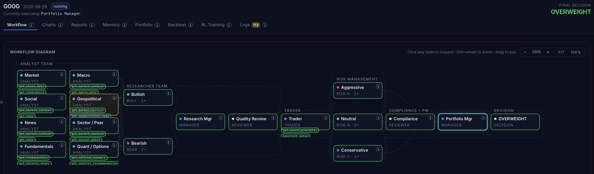

# TradingCrew

> Multi-agent **stock + commodity** research workflow built on [CrewAI](https://docs.crewai.com), with a deterministic post-LLM pipeline (sizing, risk gates, execution simulator, episodic memory, walk-forward backtest, and optional PPO training).



18 specialist LLM agents debate a trade idea; the verdict is then fed through 7 deterministic modules (M1–M7) so the *narrative* comes from an LLM but the *sizing, risk, and execution* are pure code you can read.

---

## Why this exists

LLM-only trading agents are great at producing a confident-sounding rationale and terrible at producing a trade you'd actually let touch a book. TradingCrew puts an auditable, LangChain-free deterministic layer **after** the LLM debate so every decision lands as a typed `ActionProposal` that goes through:

| Stage | What it does |
| --- | --- |
| **M1** Bridge | Maps `PortfolioDecision` (LLM) → typed `ActionProposal` |
| **M2** Simulator | Next-bar fills + fees + half-spread + √-impact + partial fills |
| **M3** Episodic memory | Outcome-embargoed retrieval of past trades (no future leakage) |
| **M4** Reflective critic | 5-stage critique + 3-temperature consistency vote → may force ABSTAIN |
| **M5** Sizer + risk gates | Fractional Kelly × vol-target × CVaR clamp, then 6 hard gates |
| **M6** Walk-forward backtest | Embargoed train/test folds, **Deflated Sharpe** ranking |
| **M7** Allocator | HRP / Mean-Variance / Equal-Risk across all tickers |

See [`docs/DETAILS.md`](docs/DETAILS.md) for the full design, every endpoint, and the L2/L3/L4 training loops.

## Features at a glance

- **Two dashboards on one backend** — `/stock` (18-agent equities crew) and `/commodity` (17-agent futures crew with curve/COT/seasonality tools). Both run the same M1–M7 deterministic layer; only the cost-model preset differs.
- **Live workflow visualisation** — left-to-right SVG flow with idle / running (animated cyan dash) / done / degraded edge states; per-tool chip strip under each agent.
- **LLM + embedder picker in the UI** — switch between hosted vLLM, local vLLM, OpenAI, or Anthropic per run; the closed-source options grey out until the matching API key is set.
- **Multi-region tickers** — `AAPL`, `RELIANCE.NS`, `0700.HK`, `7203.T`, `HSBA.L`, `CL=F`, … resolved automatically with the right macro basket + news themes per country.
- **Three training loops** — L2 reflection on resolved outcomes, L3 walk-forward grid search ranked by Deflated Sharpe, and L4 PPO on the M2 simulator (≈ 60–120s on CPU for a single ticker).
- **Full audit trail** — every run is persisted to `~/.trading_crew/runs/{TICKER}/{ts}.json`. Open the **Recent runs** panel in the sidebar to re-load any prior run into the dashboard without re-running.

## Quick start

```bash
python -m venv .venv
.venv/bin/pip install -r requirements.txt

cp .env.example .env       # fill in VLLM_LLM_* + TAVILY_API_KEY at minimum

PORT=8001 ./run_web.sh               # binds 0.0.0.0:8001
```

Open <http://localhost:8001> → pick a ticker → **Run analysis**.

For a single-shot CLI run (no UI):

```bash
.venv/bin/python main.py NTNX --debate-rounds 2 --risk-rounds 1
```

See [`docs/DETAILS.md`](docs/DETAILS.md#quick-start) for the full configuration options, every env var, the LLM / embedder presets, the per-run call estimator, and the parallel memory save pool.

## Project layout (top level)

```
agentic_workflow/
├── main.py               # CLI entry point: python main.py NTNX
├── run_web.sh            # launches the FastAPI UI on :8001
├── trading_crew/         # 18-agent equities crew + M1–M7 deterministic core
│   ├── crew.py           # @CrewBase, agents/tasks via @agent / @task
│   ├── tools.py          # 18 @tool functions (yfinance + Tavily)
│   ├── critic.py         # M4 reflective critic
│   └── agentic/          # asset-class-agnostic deterministic Layer-A
│       ├── portfolio/    # state, allocator (HRP / MV / EQR)
│       ├── execution/    # cost models, next-bar fill simulator
│       ├── memory/       # episodic / semantic / regime
│       ├── risk/         # VaR/CVaR, sizing, gates
│       ├── backtest/     # walk-forward engine, Deflated Sharpe
│       └── rl/           # L4 PPO trainer (env, networks, storage)
├── commodity_crew/       # 17-agent futures crew (curve, COT, seasonality)
├── web/                  # FastAPI backend + Alpine.js frontend
├── scripts/              # sector_bias_basket, decision_impact_demo, audit_run, ...
├── tests/                # 410+ tests covering everything above
├── docs/                 # detailed design + screenshots
└── requirements.txt
```

## Tests

```bash
.venv/bin/pip install pytest pytest-asyncio
.venv/bin/python -m pytest tests/
```

410+ tests across every M1–M7 module, both crews, the FastAPI endpoints, the WebSocket runner, the L2/L3/L4 training loops, the degraded-output detection, and the ticker resolver.

## Inspiration & references

- **TauricResearch/TradingAgents** — the high-level multi-agent debate topology (analyst team → bull/bear → trader → 3-way risk → PM) is inspired by this Apache-2.0 project. <https://github.com/TauricResearch/TradingAgents>
- **Xiao et al., "TradingAgents: Multi-Agents LLM Financial Trading Framework"** — arXiv:[2412.20138](https://arxiv.org/abs/2412.20138) (2025).
- **Deterministic Layer-A design** — the M1–M7 contract (bridge, simulator, memory, critic, sizer + gates, walk-forward, allocator) draws on arXiv:[2605.19337](https://arxiv.org/pdf/2605.19337).

TradingCrew is an independent implementation: it is built on **CrewAI** (not LangGraph), adds a futures dashboard with cost-model presets, ships its own FastAPI/WebSocket web UI, and contributes the deterministic M1–M7 post-LLM pipeline + L2/L3/L4 training loops. No source code is copied from the upstream project. See [`NOTICE`](NOTICE) for the full attribution.

## Disclaimer

This project is for **research and educational purposes only**. The deterministic risk layer is intentionally conservative, but LLM outputs are non-deterministic, market data is delayed, and back-tested performance is not a guarantee of future returns. **Nothing in this repository is investment advice.**

## License

Apache License 2.0 — see [`LICENSE`](LICENSE) and [`NOTICE`](NOTICE).
